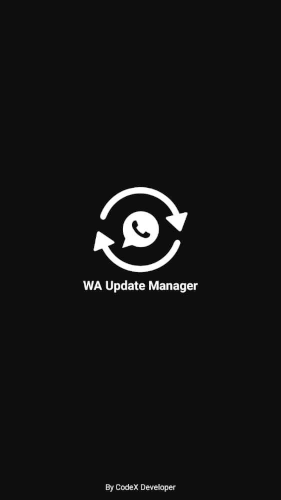

# whatsapp-update-manager

Modified WhatsApp clients like GB or Aero WhatsApp turn out well and have very advanced features. 
Updating these apps is a tedious task as we have to download them from third-party websites that contain annoying ads.

So after a few months, this crazy idea came to my mind "why don't I make an Update Manager for WhatsApp, which will download, update these modified WhatsApp clients, have an easy and understandable UI, and be less than 10MB?" and that's how WhatsApp Update Manager was born.

After a few months of development, I am finally ready to introduce WhatsApp Update Manager to the masses. It has various settings for customization and an easy-to-use interface for a better user experience.

# Why WhatsApp Update Manager ⁉️
- [ ] Simple and User-friendly interface
- [ ] Ad-Free experience
- [ ] Fast downloading speed
- [ ] Push Notification
- [ ] Single Click Download
- [ ] Small Size (less than 10MB)
- [ ] Smart Download Feature (It will delete the previously downloaded APK file when you download the new version of that MOD)

# WhatsApp Mods 📜
●   FM WhatsApp  
●   GB WhatsApp  
●   Aero WhatsApp  
●   YO WhatsApp  
●   Fouad WhatsApp  

# Screenshots 📸

# Using Android Studio 💻
Clone the Repository, open it in Android Studio and build the application.

# Contributions 🤝
  Anyone can contribute to this project in two ways
  
- [ ] You can help us in updating database (E-mail for query)
- [ ] You can help us in making this app fast through professional codding skills.

# Reach Us (Social Media) 🚀
  
- [ ] https://www.facebook.com/itx.jadiii
- [ ] http://www.instagram.com/jd._.xx_/
- [ ] https://snapchat.com/add/oye_jd

# Contact Us 📞
  
- [ ] jawad2k01@gmail.com (E-mail)
- [ ] +923090092020 (WhatsApp)

